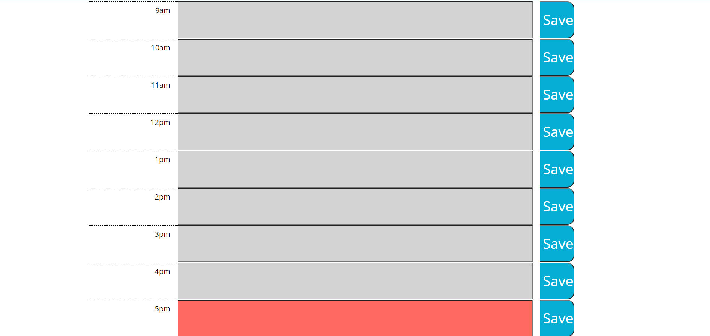

# Work-Day-Scheduler
###Weekly Challenge 5

###Description
URL : https://adambelin.github.io/Work-Day-Scheduler/

This website is used to plan out your workday. There will be different colored sections of time to show what is in the past present and future. It can be closed and reopened while saving all data that has already been input.

Screenshots

Header

Body
